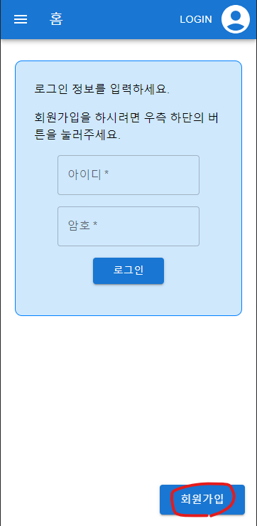

# 동네고양이 길드신청표

# 소개

<aside>
📢 동네고양이 길드 레이드 신청표 작성을 위한 웹 페이지입니다.
’태신’ 이 개발하였습니다.
각종 버그 및 개선, 문의사항은 오픈톡 프로필을 눌러 1:1 오픈톡 주시거나, 해당 노션에 댓글 달아주시면 감사하겠습니다.

**p.s. 프로필사진 등록을 원하시면 저에게 1:1비율의 사진을 전달해주시고 ID를 알려주시면 반영해드리겠습니다 :)**

</aside>

# 접속주소

# [레이드 신청표바로가기 링크 클릭!](http://loa-countrycat.com/)

주소 : [http://loa-countrycat.com/](http://loa-countrycat.com/)

---

---

# 사용법

## 회원가입

회원가입 버튼을 눌러 가입

<aside>
❗ 비밀번호는 암호화되어 저장됩니다.

</aside>

- 회원가입 후 반드시 `캐릭터관리` 페이지에서 캐릭터를 등록할것!

---

## 캐릭터관리

‘캐릭터관리’페이지에서 캐릭터를 추가하고 대표캐릭터를 지정하세요

<aside>
☝ 레이드 신청표에서 
**캐릭터 이름을 클릭**하면 
해당 유저가 설정한 
대표 캐릭터의 닉네임을 보여줍니다!

</aside>

---

## 회원정보 수정

- `“회원정보 관리”` 메뉴에서 `비밀번호 변경`을 할 수 있습니다.
- “프로필 이미지 등록”의 경우 이미지 등록을 위한 
서버 개발 시, 현재 백엔드 서버의 용량이 
400mb밖에 되지 않아 이미지를 첨부할 경우 
용량이 금방 가득 찰 수 있어서 
**제가 직접 등록**해 드리는 방식을 유지 하겠습니다.
`이미지 선택 후 저장 시 “오픈톡 문의” 관련 안내팝업이 발생하도록 하였습니다.`

---

## 컨텐츠 선택

원하는 컨텐츠를 선택하세요.

‘+’ 버튼을 눌러 일정을 등록하세요

- 일정 내용을 입력한 뒤 ‘확인’ 버튼을 눌러 레이드 일정을 만들어주세요.
- **레이드 일정을 만든 후에는 본인도 참여를 신청해야합니다!**

---

## 구인공고

- 구인공고를 클릭하여 접속합니다.
- 우측 하단 ‘+’ 버튼으로 구인공고를 작성합니다.
- 댓글 작성
    - 댓글보기를 눌러 입력란+조회란 을 활성화시킵니다.

---

---

# 주의사항

- IPhone 12 Pro 기준으로 UI를 제작했습니다. PC환경이나 특정 휴대폰`(갤폴드)`는 적절히 화면크기를 조절해주세요.
- 캐릭터 삭제시 참여중인 레이드 일정에서 모두 삭제되니 **주의**하세요!
- 레이드 일정은 해당 일자가 지나면 보이지 않게되니 **주의**하세요!
- 날짜 미정인 경우 계속해서 표시되니 **완료 후 삭제**하거나, 날짜 미정을 풀어주세요..

---

---

## 패치내역

### [2023.10.10] 일정수정 Dialog 관련 버그 수정

일정수정 팝업 표시 후 다른 일정을 수정하려고 할 때, 이전 일정내용이 표시되는 문제를 수정하였습니다.

### [2023.09.26] 레이드 일정 신청자 구조 개선

레이드 신청자 메모를 더 쉽게 보기위해, 캐릭터 표시 아래로 표시하도록 했습니다.
수정버튼, 삭제버튼이 캐릭터 정보 우측에 표시됩니다.

### [2023.09.25] 페이지 구조 개선

1. 기본화면을 “구인공고” 페이지로 변경하였습니다.
(구인공고 기능 활성화를 위함)
2. [버그] 레이드 일정 수정 시 추가버튼(Fab버튼) 이 보이던 현상 수정

### [2023.09.19] 회원정보 관리 페이지 추가

1. 회원정보 관리(비밀번호 변경) 페이지가 추가되었습니다.
비밀번호가 ‘1’로 모두 초기화되었습니다.
2. 이미지 등록 영역을 생성하였습니다.
다만, 이미지 등록을 위한 서버 개발 시
현재 백엔드 서버의 용량이 400mb밖에 되지 않아 이미지를 첨부할 경우 용량이 금방 가득 찰 수 있어서 현재의 방식대로 제가 직접 등록해드리는거로 유지하겠습니다.
이미지 선택 후 저장 시 “오픈톡 문의” 관련 안내팝업이 발생하도록 하였습니다.

### [2023.09.18] 구인공고 수정 기능 추가

구인공고 수정 기능이 추가되었습니다.

댓글 수정기능은 구현하지 않을 예정입니다.(삭제만 유지)

### [2023.09.15] 레이드 일정 추가/수정 팝업 변경

레이드 일정 추가 및 수정팝업을 좀 이쁘게 바꿧습니다.
날짜를 달력으로 선택할 수 있도록 변경하였습니다.
불편하시다면 언제든 말씀해주세요.

### [2023.09.14] 구인공고 기능 추가 및 레이드 메인화면 수정

구인공고 기능을 추가하였습니다.
아직 미완성된 기능이라 추가/삭제만 가능합니다.

레이드 메인화면을 좀 이쁘게 바꿔보았습니다.

### [2023.08.07] 비고란 증대 및 레이드 카드 패치

> 레이드 일정 신청 비고 50자까지 확대
직업 이름 간소화
레이드카드 글자 크기 줄임
>